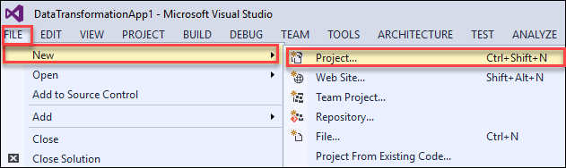
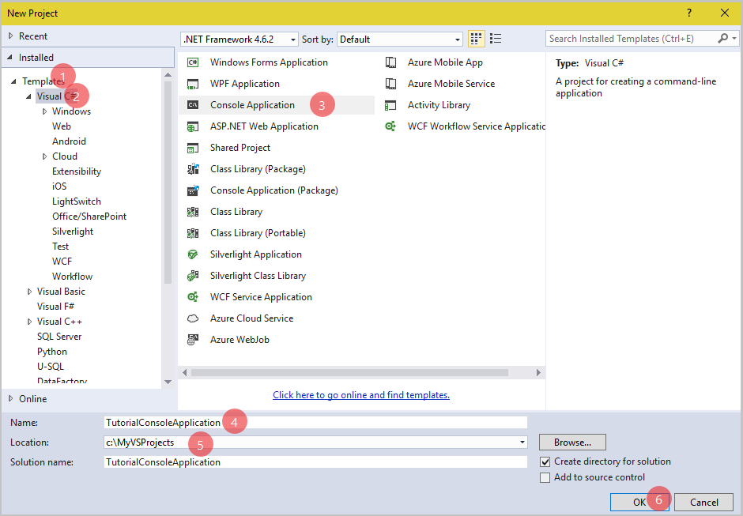
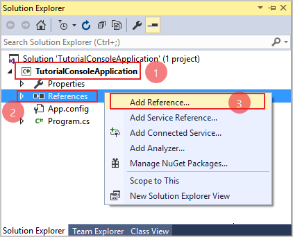
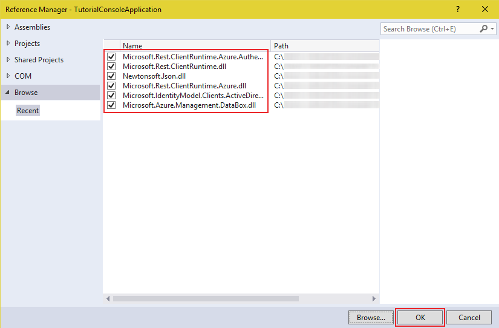

# Get started with Azure DataBox using .NET

## Overview
 This article details how to create a sample .NET console application to initiate/communicate azure data box order or job.

 ## Prerequisites

Before you begin, ensure that you have:
*	A computer running:
    - [Microsoft Visual Studio](https://www.visualstudio.com/)
    - Azure Data Box Client Library for .NET, download below dependent dll
      - [Microsoft.Azure.Management.DataBox.dll](https://github.com/bkrishna-hari/azure-data-box-get-dotnet-started/blob/master/dlls/Microsoft.Azure.Management.DataBox.dll?raw=true)

## Set up Azure Service Principal
* You need to setup [Azure Active Directory Service Principal credentials](https://docs.microsoft.com/en-us/azure/azure-resource-manager/resource-group-create-service-principal-portal) in your Azure Subscription for this sample application. This will give this application permission to create, track Data Box orders.

  >[!Note:]
  > * Assign **`Contributor`** role to the AAD application. In the above article, a "Reader" role is described.

* Once your AAD App is ready; fetch the following values:
  * Tenant ID
  * Subscription ID
  * Application ID
  * Active Directory key

## Code sample
We have provided a sample Visual Studio console application here: [Getting Started with Azure Data Box](https://github.com/bkrishna-hari/azure-data-box-get-dotnet-started/blob/master/samples/TutorialConsoleApplication.zip?raw=true). If you want to create this application from scratch, please continue with the following steps. Else, you can download this application and run it.

## Set up your development environment
Set up your development environment in Visual Studio so you're ready to try examples in this guide.

### Create a Windows console application project
In Visual Studio, create a new Windows console application. The following steps show you how to create a console application in Visual Studio 2015. The steps are similar in other versions of Visual Studio.

  1. Launch **Visual Studio 2015**.
  2. Select **File &gt; New &gt; Project**.

  

  3. Select **Installed &gt; Templates &gt; Visual C# &gt; Console Application**. Make sure you choose .Net Framework 4.6.2 as shown in the figure.
  4. In the **Name** field, enter a name for your application and browse **Location**.
  5. Click **OK** to create the project.

  

Now, add Azure Data Box dll present in the [dlls folder](https://github.com/bkrishna-hari/azure-data-box-get-dotnet-started/tree/master/dlls) as **References** in the project that you created. To add the dll file, perform the following:

  1. In Visual Studio, go to **View &gt; Solution Explorer**.
  2. Click the arrow to the left of TutorialConsoleApplication project. Click **References** and then right-click to **Add Reference**.

  

  3. Browse to the location of the dll that you downloaded, select the dll and click **Add**, then click **OK**.

  


### Configure your configuration settings
  To configure your configuration settings, open the `app.config` file from Solution Explorer in Visual Studio. Add the contents of the <appSettings> element shown below. Replace `tenant-id` with the tenant ID of the subscription, `subscription-id` with the subscription ID, `aad-application-id` with application ID for which the service principal was set, and `aad-application-key` with application authentication key for which the AAD application:

  ```
  <configuration>
    <startup>
      <supportedRuntime version="v4.0" sku=".NETFramework,Version=v4.6.2" />
    </startup>
    <appSettings>
      <!--Input the TenantID of the subscription-->
      <add key="TenantId" value="tenant-id" />

      <!--Input SubscriptionID-->
      <add key="SubscriptionId" value="subscription-id" />

      <!--Input application ID for which the service principal was set-->
      <add key="AADApplicationId" value="aad-application-id" />

      <!--Input application authentication key for which the AAD application-->
      <add key="AADApplicationKey" value="aad-application-key" />
    </appSettings>
  </configuration>
  ```


### Use NuGet to install the required packages
You need to reference the following nuget packages in your project:

  * [Newtonsoft.Json](https://www.nuget.org/packages/Newtonsoft.Json/). This package is a popular high-performance JSON framework for .NET.
  * [Microsoft.Rest.ClientRuntime.Azure](https://www.nuget.org/packages/Microsoft.Rest.ClientRuntime.Azure). This package provides common error handling, tracing, and HTTP/REST-based pipeline manipulation.
  * [Microsoft.Rest.ClientRuntime.Azure.Authentication](https://www.nuget.org/packages/Microsoft.Rest.ClientRuntime.Azure.Authentication). This package provides ADAL (Azure Active Directory Authentication Library) based authentication for Azure management client libraries.
  * [Microsoft.WindowsAzure.ConfigurationManager](https://www.nuget.org/packages/Microsoft.WindowsAzure.ConfigurationManager). This package provides a class for parsing a connection string in a configuration file, regardless of where your application is running.

To do this, follow these steps:

  1. Right-click your project in **Solution Explorer**, and choose **Manage NuGet Packages** **&gt;** Click **Browse** tab.
  2. Search online for "Newtonsoft.Json", and click **Install** to install the Newtonsoft Json library.
  3. Search online for "Microsoft.Rest.ClientRuntime.Azure", and click **Install** to install the Microsoft Azure Client Runtime library.
  4. Search online for "Microsoft.Rest.ClientRuntime.Azure.Authentication", and click **Install** to install the Microsoft Azure Authentication library and its dependencies.
  5. Search online for "WindowsAzure.ConfigurationManager", and click **Install** to install the Microsoft Azure Configuration Manager Library.


### Add using directives
Add the following using statements to the source file `Program.cs` in the project.

  ```
  using Microsoft.Azure;
  using Microsoft.Azure.Management.DataBox;
  using Microsoft.Azure.Management.DataBox.Models;
  using Microsoft.Rest;
  using Microsoft.Rest.Azure;
  using Microsoft.Rest.Azure.Authentication;
  ```

### Add static variables
Add the following statements before `Main()` method:

  ```
  private static string tenantId;
  private static string subscriptionId;
  private static string aadApplicationId;
  private static string aadApplicationKey;
  ```

### Initialize Data Box Management Client
The DataBoxManagementClient class enables you to create a new Data Box order or job, retrieve order details, cancel/delete order, validate shipping address and etc.

Add below code after `Main()` method:

  ```
  static DataBoxManagementClient InitializeDataBoxClient()
  {
      const string frontDoorUrl = "https://login.microsoftonline.com";
      const string tokenUrl = "https://management.azure.com";

      // Set the configuration parameters
      tenantId = CloudConfigurationManager.GetSetting("TenantId");
      subscriptionId = CloudConfigurationManager.GetSetting("SubscriptionId");
      aadApplicationId = CloudConfigurationManager.GetSetting("AADApplicationId");
      aadApplicationKey = CloudConfigurationManager.GetSetting("AADApplicationKey");

      // Validates AAD ApplicationId and returns token
      var credentials = ApplicationTokenProvider.LoginSilentAsync(
                          tenantId,
                          aadApplicationId,
                          aadApplicationKey,
                          new ActiveDirectoryServiceSettings()
                          {
                              AuthenticationEndpoint = new Uri(frontDoorUrl),
                              TokenAudience = new Uri(tokenUrl),
                              ValidateAuthority = true,
                          }).GetAwaiter().GetResult();

      // Initializes a new instance of the DataBoxManagementClient class
      DataBoxManagementClient dataBoxManagementClient =
          new DataBoxManagementClient(
            credentials);

      // Set SubscriptionId
      dataBoxManagementClient.SubscriptionId = subscriptionId;

      return dataBoxManagementClient;
  }
  ```

### Fetch order details
The code below fetches information about the specified order. Replace your Main() method with the following snippet. You will need to enter the resource group name and job name in the code.

  ```
  static void Main(string[] args)
  {
      // Name of the resource group on which to retrieve job details
      string resourceGroupName = "<resource-group-name>";

      // Name of the job within the specified resource group
      string jobName = "<job-name>";

      // Gets job complete info (details) or basic (null) info
      string expand = "details";

      // Initializes a new instance of the DataBoxManagementClient class.
      DataBoxManagementClient dataBoxManagementClient = InitializeDataBoxClient();

      // Gets information about the specified job.
      JobResource jobResource = JobsOperationsExtensions.Get(
                                  dataBoxManagementClient.Jobs,
                                  resourceGroupName,
                                  jobName,
                                  expand);
  }
  ```

In Get call, `$expand` variable is supported on `details` parameter for order, which returns order stages, contact information and etc. Otherwise set `null` value to `$expand` variable which gets only basic information.

### List orders
Below code fetches list of available orders under the subscription. Add it into the Main() method that you already have in your code.

  ```
  // Initializes a new instance of the DataBoxManagementClient class.
  DataBoxManagementClient dataBoxManagementClient = InitializeDataBoxClient();

  IPage<JobResource> jobPageList = null;
  List<JobResource> jobList = new List<JobResource>();

  do
  {
    // Lists all the jobs available under the subscription.
    if (jobPageList == null) {
      jobPageList = JobsOperationsExtensions.List(
                      dataBoxManagementClient.Jobs);
    }
    else {
      jobPageList = JobsOperationsExtensions.ListNext(
                      dataBoxManagementClient.Jobs,
                      jobPageList.NextPageLink);
    }

    jobList.AddRange(jobPageList.ToList());

  } while (!(string.IsNullOrEmpty(jobPageList.NextPageLink)));
  ```

### List the orders by Resource group
Below code fetches list of available orders under Resource group. Add it into the Main() method that you already have in your code. You will need to enter the resource group name in the code.

  ```
  // Input the name of the resource group on which to retrieve list of jobs
  string resourceGroupName = "<resource-group-name>";

  // Initializes a new instance of the DataBoxManagementClient class.
  DataBoxManagementClient dataBoxManagementClient = InitializeDataBoxClient();

  IPage<JobResource> jobPageList = null;
  List<JobResource> jobList = new List<JobResource>();

  do
  {
    // Lists all the jobs available under resource group.
    if (jobPageList == null) {
      jobPageList = JobsOperationsExtensions.ListByResourceGroup(
                      dataBoxManagementClient.Jobs,
                      resourceGroupName);
    }
    else {
      jobPageList = JobsOperationsExtensions.ListByResourceGroupNext(
                      dataBoxManagementClient.Jobs,
                      jobPageList.NextPageLink);
    }

    jobList.AddRange(jobPageList.ToList());

  } while (!(string.IsNullOrEmpty(jobPageList.NextPageLink)));
  ```

### Validate shipping address
Below code validates shipping address whether it is valid or not. In ambiguous state, provides alternate address(es) based on input address. Add it into the Main() method that you already have in your code. You will need to enter the location, shipping address details (like address type, company name, street info, postal code, city, state/province code, country) in the code.

  ```
  // Input the location on which shipping address to be validated
  // Support locations: West Europe, West Central US and West US
  string location = "<location>";

  // Initializes a new instance of the DataBoxManagementClient class
  DataBoxManagementClient dataBoxManagementClient = InitializeDataBoxClient();
  dataBoxManagementClient.Location = location;

  // (Optional) Choose the Address type from AddressType list. eg. AddressType.None (Default value)
  AddressType addressType = "<address-type>";

  // (Optional) Input the name of the company
  string companyName = "<company-name>";

  // Input the street address1
  string streetAddress1 = "<street-address1>";

  // (Optional) Input the street address2
  string streetAddress2 = "<street-address2>";

  // (Optional) Input the street address3
  string streetAddress3 = "<street-address3>";   

  // Input the area postal code
  string postalCode = "<postal-code>";          

  // Input the name of the city
  string city = "<city-name>";                  

  // Input the state or province code. Like CA - California; FL - Florida; NY - New York
  string stateOrProvinceCode = "<state-or-province-code>";

  // Choose the Country code from CountryCode list. eg. CountryCode.US
  CountryCode countryCode = "<country-code>";   

  ShippingAddress shippingAddress = new ShippingAddress()
  {
      AddressType = addressType,
      CompanyName = companyName,
      StreetAddress1 = streetAddress1,
      StreetAddress2 = streetAddress2,
      StreetAddress3 = streetAddress3,
      City = city,
      StateOrProvince = stateOrProvinceCode,
      Country = countryCode.ToString(),
      PostalCode = postalCode
  };

  ValidateAddress validateAddress =
      new ValidateAddress(
            shippingAddress,
            DeviceType.Pod);

  AddressValidationOutput addressValidateResult =
      ServiceOperationsExtensions.ValidateAddressMethod(
          dataBoxManagementClient.Service,
          validateAddress);

  // Checks validation address result
  if(addressValidateResult.ValidationStatus != AddressValidationStatus.Valid)
  {
      Console.WriteLine("Address validation status: {0}", addressValidateResult.ValidationStatus);

      // Prints alternate address(es)
      if (addressValidateResult.ValidationStatus == AddressValidationStatus.Ambiguous)
      {
          Console.WriteLine("\nALTERNATE ADDRESS(ES):");
          foreach (ShippingAddress address in addressValidateResult.AlternateAddresses)
          {
              Console.WriteLine("\nAddress type: {0}", address.AddressType);
              if (!(string.IsNullOrEmpty(address.CompanyName)))
                  Console.WriteLine("Company name: {0}", address.CompanyName);
              if (!(string.IsNullOrEmpty(address.StreetAddress1)))
                  Console.WriteLine("Street address1: {0}", address.StreetAddress1);
              if (!(string.IsNullOrEmpty(address.StreetAddress2)))
                  Console.WriteLine("Street address2: {0}", address.StreetAddress2);
              if (!(string.IsNullOrEmpty(address.StreetAddress3)))
                  Console.WriteLine("Street address3: {0}", address.StreetAddress3);
              if (!(string.IsNullOrEmpty(address.City)))
                  Console.WriteLine("City: {0}", address.City);
              if (!(string.IsNullOrEmpty(address.StateOrProvince)))
                  Console.WriteLine("State/Province: {0}", address.StateOrProvince);
              if (!(string.IsNullOrEmpty(address.Country)))
                  Console.WriteLine("Country: {0}", address.Country);
              if (!(string.IsNullOrEmpty(address.PostalCode)))
                  Console.WriteLine("Postal code: {0}", address.PostalCode);
              if (!(string.IsNullOrEmpty(address.ZipExtendedCode)))
                  Console.WriteLine("Zip extended code: {0}", address.ZipExtendedCode);
          }
      }
      Console.ReadLine();
  }
  ```

### Create a new Order
Below code creates a new Azure Data Box order. Add it into the Main() method that you already have in your code. You will need to enter the location, shipping address details (like address type, company name, street info, postal code, city, state/province code, country), contact details (like contact name, notification email list, phone number) and destination storage account details (like resource group name, provider type, account name, account type) in the code.

  ```
  // Input the location on which new azure data box job to be created
  // Support locations: West Europe, West Central US and West US
  string location = "<location>";

  // Initializes a new instance of the DataBoxManagementClient class.
  DataBoxManagementClient dataBoxManagementClient = InitializeDataBoxClient();
  dataBoxManagementClient.Location = location;

  // (Optional) Choose the Address type from AddressType list. eg. AddressType.None (Default value)
  AddressType addressType = "<address-type>";

  // (Optional) Input the name of the company
  string companyName = "<company-name>";

  // Input the street address1
  string streetAddress1 = "<street-address1>";

  // (Optional) Input the street address2
  string streetAddress2 = "<street-address2>";

  // (Optional) Input the street address3
  string streetAddress3 = "<street-address3>";

  // Input the area postal code
  string postalCode = "<postal-code>";         

  // Input the name of the city
  string city = "<city-name>";                 

  // Input the state or province code. Like CA - California; FL - Florida; NY - New York
  string stateOrProvinceCode = "<state-or-province-code>";

  // Choose the Country code from CountryCode list. eg. CountryCode.US
  CountryCode countryCode = "<country-code>";  

  ShippingAddress shippingAddress = new ShippingAddress()
  {
      AddressType = addressType,
      CompanyName = companyName,
      StreetAddress1 = streetAddress1,
      StreetAddress2 = streetAddress2,
      StreetAddress3 = streetAddress3,
      City = city,
      StateOrProvince = stateOrProvinceCode,
      Country = countryCode.ToString(),
      PostalCode = postalCode
  };

  // Input a semicolon (;) separated string of email ids, eg. "abc@outlook.com;xyz@outlook.com"
  string emailIds = "<notification-email-ids>";

  // Input the phone number
  string phoneNumber = "<phone-number>";

  // Input the name of the contact
  string contactName = "<contact-name>";

  List<string> emailList;
  emailList = emailIds.Split(new char[';'], StringSplitOptions.RemoveEmptyEntries).ToList();

  ContactDetails contactDetails = new ContactDetails()
  {
      Phone = phoneNumber,
      EmailList = emailList,
      ContactName = contactName
  };

  // Input the storage account provider type;  Valid types: Microsoft.Storage / Microsoft.ClassicStorage
  string storageAccProviderType = "<storage-acc-provider-type>";

  // Input the name of the storage account's resource group
  string storageAccResourceGroupName = "<storage-acc-resource-group>";

  // Input the name of the storage account
  string storageAccName = "<storage-acc-name>";

  // Choose account type from Storage AccountType list. eg. AccountType.GeneralPurposeStorage
  AccountType accountType = "<account-type>";

  List<DestinationAccountDetails> destinationAccountDetails = new List<DestinationAccountDetails>();
  destinationAccountDetails.Add(
      new DestinationAccountDetails(
          string.Concat("/subscriptions/", subscriptionId.ToLower(),
              "/resourceGroups/", storageAccResourceGroupName.ToLower(),
              "/providers/", storageAccProviderType,
              "/storageAccounts/", storageAccName.ToLower()),
          accountType));

  // Note.
  // For multiple destination storage accounts, follow above steps to add more accounts.
  // All storage accounts should be in same location (region).
  // The storage account(s) should be in same subscription as Azure DataBox order's.

  PodJobDetails jobDetails = new PodJobDetails(
                              contactDetails,
                              shippingAddress);

  string resourceGroupName = "<resource-group-name>"; // Input the name of the resource group
  string jobName = "<job-name>";  // Input the name of the job

  // Initializes a new instance of the JobResource class
  JobResource newJobResource = new JobResource(location,
                                  destinationAccountDetails,
                                  jobDetails);
  newJobResource.DeviceType = DeviceType.Pod;

  // Validate shipping address
  AddressValidationOutput addressValidateResult =
      ServiceOperationsExtensions.ValidateAddressMethod(
          dataBoxManagementClient.Service,
          new ValidateAddress(
            shippingAddress,
            newJobResource.DeviceType));

  // Checks validation address result
  if (addressValidateResult.ValidationStatus != AddressValidationStatus.Valid)
  {
      Console.WriteLine("Address validation status: {0}", addressValidateResult.ValidationStatus);

      // Prints alternate address
      if (addressValidateResult.ValidationStatus == AddressValidationStatus.Ambiguous)
      {
          Console.WriteLine("\nSUPPORT ADDRESSES:");
          foreach (ShippingAddress address in addressValidateResult.AlternateAddresses)
          {
              Console.WriteLine("\nAddress type: {0}", address.AddressType);
              if (!(string.IsNullOrEmpty(address.CompanyName)))
                  Console.WriteLine("Company name: {0}", address.CompanyName);
              if (!(string.IsNullOrEmpty(address.StreetAddress1)))
                  Console.WriteLine("Street address1: {0}", address.StreetAddress1);
              if (!(string.IsNullOrEmpty(address.StreetAddress2)))
                  Console.WriteLine("Street address2: {0}", address.StreetAddress2);
              if (!(string.IsNullOrEmpty(address.StreetAddress3)))
                  Console.WriteLine("Street address3: {0}", address.StreetAddress3);
              if (!(string.IsNullOrEmpty(address.City)))
                  Console.WriteLine("City: {0}", address.City);
              if (!(string.IsNullOrEmpty(address.StateOrProvince)))
                  Console.WriteLine("State/Province: {0}", address.StateOrProvince);
              if (!(string.IsNullOrEmpty(address.Country)))
                  Console.WriteLine("Country: {0}", address.Country);
              if (!(string.IsNullOrEmpty(address.PostalCode)))
                  Console.WriteLine("Postal code: {0}", address.PostalCode);
              if (!(string.IsNullOrEmpty(address.ZipExtendedCode)))
                  Console.WriteLine("Zip extended code: {0}", address.ZipExtendedCode);
          }
      }
      return;
  }

  // Initiate to creates a new job
  JobResource jobResource = JobsOperationsExtensions.Create(
                              dataBoxManagementClient.Jobs,
                              resourceGroupName,
                              jobName,
                              newJobResource);
  ```

  >[!Note:]
  > * Order name must be between 3 and 24 characters in length and use any alphanumeric and underscore only.
  > * Azure Data Box order supports maximum 10 destination Storage accounts and all storage accounts should be in the same location (region).
  > * The storage account(s) should be in same subscription as Azure DataBox order's.
  > * Good to validate the shipping address using ValidateAddressMethod call before Create order call which verifies the shipping address and returns Validation status. Also provides alternate address(es) based on input address in `Ambiguous` state.

### Cancel order
Below code cancels the order. This will be allowed only until the order is not processed. Add it into the Main() method that you already have in your code. You will need to enter the resource group name, job name and reason in the code.

  ```
  // Input the name of the resource group
  string resourceGroupName = "<resource-group-name>";

  // Input the name of the job within the specified resource group
  string jobName = "<job-name>";  

  // Input the reason for cancellation
  string reason = "<reason-for-cancellation>";

  // Initializes a new instance of the DataBoxManagementClient class.
  DataBoxManagementClient dataBoxManagementClient = InitializeDataBoxClient();

  // Gets information about the specified job.
  JobResource jobResource = JobsOperationsExtensions.Get(
                              dataBoxManagementClient.Jobs,
                              resourceGroupName,
                              jobName);

  if (jobResource.IsCancellable != null
      && (bool) jobResource.IsCancellable)
  {
      CancellationReason cancellationReason = new CancellationReason(reason);

      // Initiate to cancel job
      JobsOperationsExtensions.Cancel(
          dataBoxManagementClient.Jobs,
          resourceGroupName,
          jobName,
          cancellationReason);
  }
  ```

### Delete order
Below code deletes the order. This will be allowed only when the order is in completed or canceled status. Add it into the Main() method that you already have in your code. You will need to enter the resource group name and job name in the code.

  ```
  // Input the name of the resource group
  string resourceGroupName = "<resource-group-name>";

  // Input the name of the job within the specified resource group
  string jobName = "<job-name>";  

  // Initializes a new instance of the DataBoxManagementClient class.
  DataBoxManagementClient dataBoxManagementClient = InitializeDataBoxClient();

  // Gets information about the specified job.
  JobResource jobResource = JobsOperationsExtensions.Get(
                              dataBoxManagementClient.Jobs,
                              resourceGroupName,
                              jobName);

  if (jobResource.Status == StageName.Cancelled
      || jobResource.Status == StageName.Completed
      || jobResource.Status == StageName.CompletedWithErrors)
  {
      // Initiate to delete job
      JobsOperationsExtensions.Delete(
        dataBoxManagementClient.Jobs,
        resourceGroupName,
        jobName);
  }
  ```

### Download shipping address
Below code provides shipping label sas uri. This will be available only after device allocation. Add it into the Main() method that you already have in your code. You will need to enter the resource group name and job name in the code.

  ```
  // Input the name of the resource group
  string resourceGroupName = "<resource-group-name>";

  // Input the name of the job within the specified resource group
  string jobName = "<job-name>";  

  // Initializes a new instance of the DataBoxManagementClient class.
  DataBoxManagementClient dataBoxManagementClient = InitializeDataBoxClient();

  // Gets information about the specified job.
  JobResource jobResource = JobsOperationsExtensions.Get(
                              dataBoxManagementClient.Jobs,
                              resourceGroupName,
                              jobName);

  if (jobResource.Status == StageName.Delivered)
  {
      // Initiate to download shipping label
      ShippingLabelDetails shippingLabelDetails =
          JobsOperationsExtensions.DownloadShippingLabelUri(
              dataBoxManagementClient.Jobs,
              resourceGroupName,
              jobName);

      // Print the shipping label uri
      Console.WriteLine("Shipping label url: \n{0}", shippingLabelDetails.ShippingLabelSasUri);
      Console.ReadLine();
  }
  else
  {
      Console.WriteLine("Shipment address will be available only when the job is in delivered stage.");
  }
  ```

### Book shipment pickup
Below code initiates the shipment pickup request. This will be allowed only when the order is in delivered status. Add it into the Main() method that you already have in your code. You will need to enter the resource group name, job name start time, end time and shipment location in the code.

  ```
  // Input the name of the resource group
  string resourceGroupName = "<resource-group-name>";

  // Input the name of the job within the specified resource group
  string jobName = "<job-name>";  

  // Minimum date after which the pick up should commence, this must be in local time of pick up area.
  DateTime dtStartTime = new DateTime("<start-time>");

  // Maximum date before which the pick up should commence, this must be in local time of pick up area.
  DateTime dtEndTime = new DateTime("<end-time>");

  // Input shipment location in the pickup place. eg. front desk
  string shipmentLocation = "<shipment-location>";

  ShipmentPickUpRequest shipmentPickUpRequest =
      new ShipmentPickUpRequest(
          dtStartTime,
          dtEndTime,
          shipmentLocation);

  // Initializes a new instance of the DataBoxManagementClient class
  DataBoxManagementClient dataBoxManagementClient = InitializeDataBoxClient();

  // Gets information about the specified job.
  JobResource jobResource = JobsOperationsExtensions.Get(
                              dataBoxManagementClient.Jobs,
                              resourceGroupName,
                              jobName);

  if (jobResource.Status == StageName.Delivered)
  {
      // Initiate Book shipment pick up
      ShipmentPickUpResponse shipmentPickUpResponse = JobsOperationsExtensions.BookShipmentPickUp(
                                                          dataBoxManagementClient.Jobs,
                                                          resourceGroupName,
                                                          jobName,
                                                          shipmentPickUpRequest);

      Console.WriteLine("Confirmation number: {0}", shipmentPickUpResponse.ConfirmationNumber);
  }
  else
  {
      Console.WriteLine("Shipment pickup will be initiated only when the job is in delivered stage.");
  }
  ```

### Get copy log Uri
Below code fetches list of copy log uri for the specified order. This will be allowed only when the order is in either data copy or completed status. Add it into the Main() method that you already have in your code. You will need to enter the resource group name and job name in the code.

  ```
  // Input the name of the resource group
  string resourceGroupName = "<resource-group-name>";

  // Input the name of the job within the specified resource group
  string jobName = "<job-name>";  

  // Initializes a new instance of the DataBoxManagementClient class
  DataBoxManagementClient dataBoxManagementClient = InitializeDataBoxClient();

  // Gets information about the specified job.
  JobResource jobResource = JobsOperationsExtensions.Get(
                              dataBoxManagementClient.Jobs,
                              resourceGroupName,
                              jobName);

  if (jobResource.Status == StageName.DataCopy
        || jobResource.Status == StageName.Completed
        || jobResource.Status == StageName.CompletedWithErrors)
  {
      // Fetches the Copy log details
      GetCopyLogsUriOutput copyLogsUriOutput = JobsOperationsExtensions.GetCopyLogsUri(
                                                dataBoxManagementClient.Jobs,
                                                resourceGroupName,
                                                jobName);

      if (copyLogsUriOutput.CopyLogDetails != null)
      {
          Console.WriteLine("Copy log details");
          foreach (AccountCopyLogDetails copyLogitem in copyLogsUriOutput.CopyLogDetails)
          {
              Console.WriteLine(string.Concat("Account name: ", copyLogitem.AccountName, Environment.NewLine, "Copy log link: ", copyLogitem.CopyLogLink, Environment.NewLine, Environment.NewLine));
          }
          Console.ReadLine();
      }
      else
      {
          Console.WriteLine("Copy logs will be available only when the job is in either data copy or completed status.");
      }
  }
  ```

### List device credentials
Below code fetches list of unencrypted device secrets related to the order (like device credentials and share credentials). This will be available only between device delivered and data copy statuses. Add it into the Main() method that you already have in your code. You will need to enter the resource group name and job name in the code.

  ```
  // Input the name of the resource group
  string resourceGroupName = "<resource-group-name>";

  // Input the name of the job within the specified resource group
  string jobName = "<job-name>";  

  // Initializes a new instance of the DataBoxManagementClient class
  DataBoxManagementClient dataBoxManagementClient = InitializeDataBoxClient();

  // Gets information about the specified job.
  JobResource jobResource = JobsOperationsExtensions.Get(
                              dataBoxManagementClient.Jobs,
                              resourceGroupName,
                              jobName);

  if (jobResource.Status != null
        && (int)jobResource.Status > (int)StageName.Dispatched
        && (int)jobResource.Status < (int)StageName.AtAzureDC)
  {
      // Fetches the list of unencrypted secrets
      UnencryptedSecrets secrets = ListSecretsOperationsExtensions.ListByJobs(
                                    dataBoxManagementClient.ListSecrets,
                                    resourceGroupName,
                                    jobName);

      PodJobSecrets podSecret = (PodJobSecrets)secrets.JobSecrets;

      if (podSecret.PodSecrets != null)
      {
          Console.WriteLine("Device credentials");
          foreach (PodSecret accountCredentials in podSecret.PodSecrets)
          {
              Console.WriteLine(" Device serial number: {0}", accountCredentials.DeviceSerialNumber);
              Console.WriteLine(" Device password: {0}", accountCredentials.DevicePassword);

              foreach (AccountCredentialDetails accountCredentialDetails in accountCredentials.AccountCredentialDetails)
              {
                  Console.WriteLine("\n   Storage account name: {0}", accountCredentialDetails.AccountName);
                  Console.WriteLine("   Share details: ");
                  foreach (ShareCredentialDetails shareCredentialDetails in accountCredentialDetails.ShareCredentialDetails)
                  {
                      Console.WriteLine("    Share name: {0}", shareCredentialDetails.ShareName);
                      Console.WriteLine("    User name: {0}", shareCredentialDetails.UserName);
                      Console.WriteLine("    Password: {0}{1}", shareCredentialDetails.Password, Environment.NewLine);
                  }
              }
          }
          Console.ReadLine();
      }
  }
  ```
