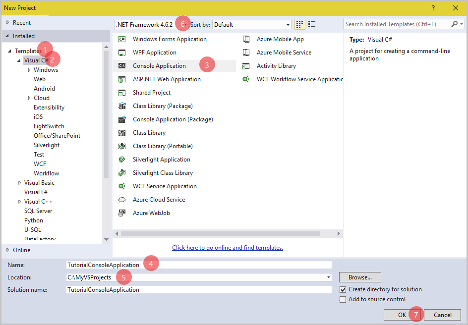
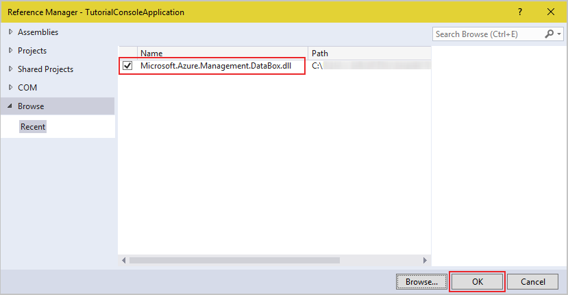

# Get started with Azure DataBox using .NET

## Overview
 This article details how to create a sample .NET console application to initiate/communicate azure data box order.

 ## Prerequisites

Before you begin, ensure that you have:
*	A computer running:
    - [Microsoft Visual Studio](https://www.visualstudio.com/)
    - Azure Data Box Client Library for .NET, download below dependent dlls
      - [Microsoft.Azure.Management.DataBox.dll](https://github.com/bkrishna-hari/azure-data-box-get-dotnet-started/blob/master/dlls/Microsoft.Azure.Management.DataBox.dll?raw=true)
      - [Microsoft.IdentityModel.Clients.ActiveDirectory.dll](https://github.com/bkrishna-hari/azure-data-box-get-dotnet-started/blob/master/dlls/Microsoft.IdentityModel.Clients.ActiveDirectory.dll?raw=true)
      - [Microsoft.Rest.ClientRuntime.Azure.Authentication.dll](https://github.com/bkrishna-hari/azure-data-box-get-dotnet-started/blob/master/dlls/Microsoft.Rest.ClientRuntime.Azure.Authentication.dll?raw=true)
      - [Microsoft.Rest.ClientRuntime.Azure.dll](https://github.com/bkrishna-hari/azure-data-box-get-dotnet-started/blob/master/dlls/Microsoft.Rest.ClientRuntime.Azure.dll?raw=true)
      - [Microsoft.Rest.ClientRuntime.dll](https://github.com/bkrishna-hari/azure-data-box-get-dotnet-started/blob/master/dlls/Microsoft.Rest.ClientRuntime.dll?raw=true)
      - [Newtonsoft.Json.dll](https://github.com/bkrishna-hari/azure-data-box-get-dotnet-started/blob/master/dlls/Newtonsoft.Json.dll?raw=true)

## Setup Azure Service Principal
* Need to setup [Azure Active Directory Service Principal credentials](https://docs.microsoft.com/en-us/azure/azure-resource-manager/resource-group-create-service-principal-portal) for your Azure Subscription for this sample application to run it.
<!--1. To retrieve the configuration parameters, see [Azure Active Directory Service Principal credentials](https://docs.microsoft.com/en-us/azure/azure-resource-manager/resource-group-create-service-principal-portal) document, which describes how to create an Azure Active Directory application and service principal that can access resources.-->
* Once your AAD App is ready; fetch the following values:
  * Tenant ID
  * Subscription ID
  * Application ID
  * Active Directory key

## More samples
For additional examples using Data Box, see [Getting Started with Azure Data Box](https://github.com/bkrishna-hari/azure-data-box-get-dotnet-started/blob/master/samples/MyVSProjects.zip?raw=true) in .NET. You can download the sample application and run it, or browse the code on GitHub.

## Set up your development environment
Set up your development environment in Visual Studio so you're ready to try examples in this guide.

### Create a Windows console application project
In Visual Studio, create a new Windows console application. The following steps show you how to create a console application in Visual Studio 2015. The steps are similar in other versions of Visual Studio.

  1. Launch **Visual Studio 2015**.
  2. Select **File &gt; New &gt; Project**.

  

  3. Select **Installed &gt; Templates &gt; Visual C# &gt; Console Application**.
  4. In the **Name** field, enter a name for your application and browse **Location**.
  5. Click **OK** to create the project.

  

  <!--All code examples in this tutorial can be added to the Main() method of your console application's Program.cs file.-->

Now, add all dlls present in the dlls folder as **References** in the project that you created. To add the dll files, perform the following:
  1. In Visual Studio, go to **View &gt; Solution Explorer**.
  2. Click the arrow to the left of TutorialConsoleApplication project. Click **References** and then right-click to **Add Reference**.

  

  3. Browse to the location of the packages folder, select the dll and click **Add**, then click **OK**.

  

### Add using directives
Add the following using statements to the source file `Program.cs` in the project.

  ```
  using Microsoft.Azure.Management.DataBox;
  using Microsoft.Azure.Management.DataBox.Models;
  using Microsoft.Rest;
  using Microsoft.Rest.Azure;
  using Microsoft.Rest.Azure.Authentication;
  ```

### Add static variables
Add the following statements before `Main()` method:

  ```
  private static string tenantId;
  private static string subscriptionId;
  private static string aadApplicationId;
  private static string aadApplicationKey;
  ```

### Initialize Data Box Management Client
The DataBoxManagementClient class enables you to create a new Data Box order or job, retrieve order details, cancel/delete order, validate shipping address and etc.
Add below code after `Main()` method:

  ```
  static DataBoxManagementClient InitializeDataBoxClient()
  {
      const string frontDoorUrl = "https://login.microsoftonline.com";
      const string tokenUrl = "https://management.azure.com";

      // Setup the configuration parameters
      tenantId = "<tenant-id>";               // Input Tenant ID of the subscription
      subscriptionId = "<sub-id>";            // Input Subscription ID
      aadApplicationId = "<aad-app-id>";      // Input Application ID for which the service principal was set
      aadApplicationKey = "<aad-app-key>";    // Input Application authentication key for which the AAD application

      // Validates AAD ApplicationId and returns token
      var credentials = ApplicationTokenProvider.LoginSilentAsync(
                          tenantId,
                          aadApplicationId,
                          aadApplicationKey,
                          new ActiveDirectoryServiceSettings()
                          {
                              AuthenticationEndpoint = new Uri(frontDoorUrl),
                              TokenAudience = new Uri(tokenUrl),
                              ValidateAuthority = true,
                          }).GetAwaiter().GetResult();

      // Initializes a new instance of the DataBoxManagementClient class.
      DataBoxManagementClient dataBoxManagementClient = new DataBoxManagementClient(credentials);

      // Set SubscriptionId
      dataBoxManagementClient.SubscriptionId = subscriptionId;

      return dataBoxManagementClient;
  }
  ```

### Fetch order details
Below code fetches information about the specified order.

  ```
  static void Main(string[] args)
  {
      string resourceGroupName = "<resource-group-name>"; // Name of the resource group on which to retrieve job details
      string jobName = "<job-name>"; // Name of the job within the specified resource group
      string expand = "details";     // Gets job complete info (details) or basic (null) info

      // Initializes a new instance of the DataBoxManagementClient class.
      DataBoxManagementClient dataBoxManagementClient = InitializeDataBoxClient();

      // Gets information about the specified job.
      JobResource jobResource = JobsOperationsExtensions.Get(
                                  dataBoxManagementClient.Jobs,
                                  resourceGroupName,
                                  jobName,
                                  expand);
  }
  ```

In Get call, `$expand` variable is supported on `details` parameter for order, which returns order stages, contact information and etc. Otherwise set `null` value to `$expand` variable which gets only basic information.

### List orders
Below code fetches list of available orders under the subscription.

  ```
  // Initializes a new instance of the DataBoxManagementClient class.
  DataBoxManagementClient dataBoxManagementClient = InitializeDataBoxClient();

  IPage<JobResource> jobPageList = null;
  List<JobResource> jobList = new List<JobResource>();

  do
  {
    // Lists all the jobs available under the subscription.
    if (jobPageList == null) {
      jobPageList = JobsOperationsExtensions.List(
                      dataBoxManagementClient.Jobs);
    }
    else {
      jobPageList = JobsOperationsExtensions.ListNext(
                      dataBoxManagementClient.Jobs,
                      jobPageList.NextPageLink);
    }

    jobList.AddRange(jobPageList.ToList());

  } while (!(string.IsNullOrEmpty(jobPageList.NextPageLink)));
  ```

### List the orders by Resource group
Below code fetches list of available orders under Resource group.

  ```
  // Initializes a new instance of the DataBoxManagementClient class.
  DataBoxManagementClient dataBoxManagementClient = InitializeDataBoxClient();

  IPage<JobResource> jobPageList = null;
  List<JobResource> jobList = new List<JobResource>();

  // Input the name of the resource group on which to retrieve list of jobs
  string resourceGroupName = "<resource-group-name>";

  do
  {
    // Lists all the jobs available under resource group.
    if (jobPageList == null) {
      jobPageList = JobsOperationsExtensions.ListByResourceGroup(
                      dataBoxManagementClient.Jobs,
                      resourceGroupName);
    }
    else {
      jobPageList = JobsOperationsExtensions.ListByResourceGroupNext(
                      dataBoxManagementClient.Jobs,
                      jobPageList.NextPageLink);
    }

    jobList.AddRange(jobPageList.ToList());

  } while (!(string.IsNullOrEmpty(jobPageList.NextPageLink)));
  ```

### Validate shipping address
Below code validates shipping address whether it is valid or not. In ambiguous state, provides alternate address(es) based on input address.

  ```
  AddressType addressType = <address-typ>; // (Optional) Choose the Address type from AddressType list. eg. AddressType.None (Default value)
  string companyName = "comapany-name";       // (Optional) Input the name of the company
  string streetAddress1 = "<stree-address1>"; // Input the street address1
  string streetAddress2 = "<stree-address2>"; // (Optional) Input the street address2
  string streetAddress3 = "<stree-address3>"; // (Optional) Input the street address3
  string postalCode = "<postal-code>";        // Input the area postal code
  string city = "<city-name>";                // Input the name of the city
  string stateOrProvinceCode = "<state-or-province-code>"; // Input the state or province code. Like CA - California; FL - Florida; NY - New York
  CountryCode countryCode = <country-code>;   // Choose the Country code from CountryCode list. eg. CountryCode.US

  ShippingAddress shippingAddress = new ShippingAddress()
  {
      AddressType = addressType,
      CompanyName = companyName,
      StreetAddress1 = streetAddress1,
      StreetAddress2 = streetAddress2,
      StreetAddress3 = streetAddress3,
      City = city,
      StateOrProvince = stateOrProvinceCode,
      Country = countryCode.ToString(),
      PostalCode = postalCode
  };

  // Input the location on which shipping address to be validated; Support locations: West Europe, West Central US and West US
  string location = "<location>";

  // Initializes a new instance of the DataBoxManagementClient class
  DataBoxManagementClient dataBoxManagementClient = InitializeDataBoxClient();
  dataBoxManagementClient.Location = location;

  ValidateAddress validateAddress = new ValidateAddress(
                                      shippingAddress,
                                      DeviceType.Pod);

  AddressValidationOutput addressValidationOutput = ServiceOperationsExtensions.ValidateAddressMethod(
                                                      dataBoxManagementClient.Service,
                                                      validateAddress);

  // Checks validation address result
  if(addressValidateResult.ValidationStatus != AddressValidationStatus.Valid)
  {
      Console.WriteLine("Address validation status: {0}", addressValidateResult.ValidationStatus);

      // Prints alternate address(es)
      if (addressValidateResult.ValidationStatus == AddressValidationStatus.Ambiguous)
      {
          Console.WriteLine("\nALTERNATE ADDRESS(ES):");
          foreach (ShippingAddress address in addressValidateResult.AlternateAddresses)
          {
              Console.WriteLine("\nAddress type: {0}", address.AddressType);
              if (!(string.IsNullOrEmpty(address.CompanyName)))
                  Console.WriteLine("Company name: {0}", address.CompanyName);
              if (!(string.IsNullOrEmpty(address.StreetAddress1)))
                  Console.WriteLine("Street address1: {0}", address.StreetAddress1);
              if (!(string.IsNullOrEmpty(address.StreetAddress2)))
                  Console.WriteLine("Street address2: {0}", address.StreetAddress2);
              if (!(string.IsNullOrEmpty(address.StreetAddress3)))
                  Console.WriteLine("Street address3: {0}", address.StreetAddress3);
              if (!(string.IsNullOrEmpty(address.City)))
                  Console.WriteLine("City: {0}", address.City);
              if (!(string.IsNullOrEmpty(address.StateOrProvince)))
                  Console.WriteLine("State/Province: {0}", address.StateOrProvince);
              if (!(string.IsNullOrEmpty(address.Country)))
                  Console.WriteLine("Country: {0}", address.Country);
              if (!(string.IsNullOrEmpty(address.PostalCode)))
                  Console.WriteLine("Postal code: {0}", address.PostalCode);
              if (!(string.IsNullOrEmpty(address.ZipExtendedCode)))
                  Console.WriteLine("Zip extended code: {0}", address.ZipExtendedCode);
          }
      }
  }
  ```

### Create a new Order
Below code creates a new Azure Data Box order.

  ```
  AddressType addressType = <address-typ>; // (Optional) Choose the Address type from AddressType list. eg. AddressType.None (Default value)
  string companyName = "comapany-name";       // (Optional) Input the name of the company
  string streetAddress1 = "<stree-address1>"; // Input the street address1
  string streetAddress2 = "<stree-address2>"; // (Optional) Input the street address2
  string streetAddress3 = "<stree-address3>"; // (Optional) Input the street address3
  string postalCode = "<postal-code>";        // Input the area postal code
  string city = "<city-name>";                // Input the name of the city
  string stateOrProvinceCode = "<state-or-province-code>"; // Input the state or province code. Like CA - California; FL - Florida; NY - New York
  CountryCode countryCode = <country-code>;   // Choose the Country code from CountryCode list. eg. CountryCode.US

  ShippingAddress shippingAddress = new ShippingAddress()
  {
      AddressType = addressType,
      CompanyName = companyName,
      StreetAddress1 = streetAddress1,
      StreetAddress2 = streetAddress2,
      StreetAddress3 = streetAddress3,
      City = city,
      StateOrProvince = stateOrProvinceCode,
      Country = countryCode.ToString(),
      PostalCode = postalCode
  };

  string emailIds = "<notification-email-ids>";   // Input a semicolon (;) separated string of email ids, eg. "abc@outlook.com;xyz@outlook.com"
  string phoneNumber = "<phone-number>"; // Input the phone number
  string contactName = "<contact-name>"; // Input the name of the contact

  List<string> emailList = new List<string>();
  emailList = emailId.Split(new char[';'], StringSplitOptions.RemoveEmptyEntries).ToList();

  ContactDetails contactDetails = new ContactDetails()
  {
      Phone = phoneNumber,
      EmailList = emailList,
      ContactName = contactName
  };

  string storageAccProviderType = "<storage-acc-provider-type>"; // Input the storage account provider type;  Valid types: Microsoft.Storage / Microsoft.ClassicStorage
  string storageAccResourceGroupName = "<storage-acc-resource-group>"; // Input the name of the storage account's resource group
  string storageAccName = "<storage-acc-name>"; // Input the name of the storage account
  AccountType accountType = AccountType.GeneralPurposeStorage;  // Input the storage account type

  List<DestinationAccountDetails> destinationAccountDetails = new List<DestinationAccountDetails>();
  destinationAccountDetails.Add(new DestinationAccountDetails(string.Concat("/subscriptions/", subscriptionId.ToLower(), "/resourceGroups/", storageAccResourceGroupName.ToLower(), "/providers/", storageAccProviderType, "/storageAccounts/", storageAccName.ToLower()), accountType));

  /// Note.
  /// if you need multiple destination storage accounts,
  /// add other storage account details below same as above.

  PodJobDetails jobDetails = new PodJobDetails(
                              contactDetails,
                              shippingAddress);

  string resourceGroupName = "<resource-group-name>"; // Input the name of the resource group
  string location = "<location>"; // Input the location on which new azure data box job to be created; Support locations: West Europe, West Central US and West US
  string jobName = "<job-name>";  // Input the name of the job

  // Initializes a new instance of the JobResource class
  JobResource newJobResource = new JobResource(location, destinationAccountDetails, jobDetails);
  newJobResource.DeviceType = DeviceType.Pod;

  // Initializes a new instance of the DataBoxManagementClient class.
  DataBoxManagementClient dataBoxManagementClient = InitializeDataBoxClient();
  dataBoxManagementClient.Location = location;

  // Validate shipping address
  AddressValidationOutput addressValidateResult = ServiceOperationsExtensions.ValidateAddressMethod(
                                                    dataBoxManagementClient.Service,
                                                    new ValidateAddress(
                                                      shippingAddress,
                                                      newJobResource.DeviceType));

  // Checks validation address result
  if(addressValidateResult.ValidationStatus != AddressValidationStatus.Valid)
  {
      Console.WriteLine("Address validation status: {0}", addressValidateResult.ValidationStatus);

      // Prints alternate address
      if (addressValidateResult.ValidationStatus == AddressValidationStatus.Ambiguous)
      {
          Console.WriteLine("\nSUPPORT ADDRESSES:");
          foreach (ShippingAddress address in addressValidateResult.AlternateAddresses)
          {
              Console.WriteLine("\nAddress type: {0}", address.AddressType);
              if (!(string.IsNullOrEmpty(address.CompanyName)))
                  Console.WriteLine("Company name: {0}", address.CompanyName);
              if (!(string.IsNullOrEmpty(address.StreetAddress1)))
                  Console.WriteLine("Street address1: {0}", address.StreetAddress1);
              if (!(string.IsNullOrEmpty(address.StreetAddress2)))
                  Console.WriteLine("Street address2: {0}", address.StreetAddress2);
              if (!(string.IsNullOrEmpty(address.StreetAddress3)))
                  Console.WriteLine("Street address3: {0}", address.StreetAddress3);
              if (!(string.IsNullOrEmpty(address.City)))
                  Console.WriteLine("City: {0}", address.City);
              if (!(string.IsNullOrEmpty(address.StateOrProvince)))
                  Console.WriteLine("State/Province: {0}", address.StateOrProvince);
              if (!(string.IsNullOrEmpty(address.Country)))
                  Console.WriteLine("Country: {0}", address.Country);
              if (!(string.IsNullOrEmpty(address.PostalCode)))
                  Console.WriteLine("Postal code: {0}", address.PostalCode);
              if (!(string.IsNullOrEmpty(address.ZipExtendedCode)))
                  Console.WriteLine("Zip extended code: {0}", address.ZipExtendedCode);
          }
      }
      return;
  }

  // Initiate to creates a new job
  JobResource jobResource = JobsOperationsExtensions.Create(
                              dataBoxManagementClient.Jobs,
                              resourceGroupName,
                              jobName,
                              newJobResource);
  ```

  >[!Note:]
  > * Order name must be between 3 and 24 characters in length and use any alphanumeric and underscore only.
  > * Azure Data Box order supports maximum 10 destination Storage accounts and all storage accounts should be in the same Azure Data Box order's subscription and location (region).
  > * Good to validate the shipping address using ValidateAddressMethod call before Create order call which verifies the shipping address and returns Validation status. Also provides alternate address(es) based on input address in `Ambiguous` state.

### Cancel order
Below code cancels the order

  ```
  string resourceGroupName = "<resource-group-name>"; // Input the name of the resource group
  string jobName = "<job-name>";  // Input the name of the job within the specified resource group
  string reason = "<reason-for-cancellation>"; // Input the reason for cancellation

  // Initializes a new instance of the DataBoxManagementClient class.
  DataBoxManagementClient dataBoxManagementClient = InitializeDataBoxClient();

  CancellationReason cancellationReason = new CancellationReason(reason);

  // Initiate to cancel job
  JobsOperationsExtensions.Cancel(
      dataBoxManagementClient.Jobs,
      resourceGroupName,
      jobName,
      cancellationReason);
  ```

### Delete order
Below code deletes the order

  ```
  string resourceGroupName = "<resource-group-name>"; // Input the name of the resource group
  string jobName = "<job-name>";  // Input the name of the job within the specified resource group

  // Initializes a new instance of the DataBoxManagementClient class.
  DataBoxManagementClient dataBoxManagementClient = InitializeDataBoxClient();

  // Initiate to delete job
  JobsOperationsExtensions.Delete(
    dataBoxManagementClient.Jobs,
    resourceGroupName,
    jobName);
  ```

### Download shipping address
Below code provides shipping label sas uri. This will be available only after device allocation.

  ```
  string resourceGroupName = "<resource-group-name>"; // Input the name of the resource group
  string jobName = "<job-name>";  // Input the name of the job within the specified resource group

  // Initializes a new instance of the DataBoxManagementClient class.
  DataBoxManagementClient dataBoxManagementClient = InitializeDataBoxClient();

  // Initiate to download shipping label
  ShippingLabelDetails shippingLabelDetails = JobsOperationsExtensions.DownloadShippingLabelUri(
                                                dataBoxManagementClient.Jobs,
                                                resourceGroupName,
                                                jobName);

  // Print the shipping label
  Console.WriteLine("Shipping label url: \n{0}", shippingLabelDetails.ShippingLabelSasUri);
  Console.ReadLine();
  ```

### Book shipment pickup
Below code initiates the shipment pickup request.

  ```
  string resourceGroupName = "<resource-group-name>"; // Input the name of the resource group
  string jobName = "<job-name>";  // Input the name of the job within the specified resource group

  DateTime dtStartTime = new DateTime(<start-time>); // Minimum date after which the pick up should commence, this must be in local time of pick up area.
  DateTime dtEndTime = new DateTime(<end-time>); // Maximum date before which the pick up should commence, this must be in local time of pick up area.
  string shipmentLocation = "<shipment-location>"; // Input shipment location in the pickup place. eg. front desk

  ShipmentPickUpRequest shipmentPickUpRequest = new ShipmentPickUpRequest(dtStartTime, dtEndTime, shipmentLocation);

  // Initializes a new instance of the DataBoxManagementClient class
  DataBoxManagementClient dataBoxManagementClient = InitializeDataBoxClient();

  // Initiate Book shipment pick up
  ShipmentPickUpResponse shipmentPickUpResponse = JobsOperationsExtensions.BookShipmentPickUp(
                                                      dataBoxManagementClient.Jobs,
                                                      resourceGroupName,
                                                      jobName,
                                                      shipmentPickUpRequest);

  Console.WriteLine("Confirmation number: {0}", shipmentPickUpResponse.ConfirmationNumber);
  ```

### Get copy log Uri
Below code fetches list of copy log uri for the specified order.

  ```
  string resourceGroupName = "<resource-group-name>"; // Input the name of the resource group
  string jobName = "<job-name>";  // Input the name of the job within the specified resource group

  // Initializes a new instance of the DataBoxManagementClient class
  DataBoxManagementClient dataBoxManagementClient = InitializeDataBoxClient();

  GetCopyLogsUriOutput copyLogsUriOutput = JobsOperationsExtensions.GetCopyLogsUri(
                                            dataBoxManagementClient.Jobs,
                                            resourceGroupName,
                                            jobName);

  if (copyLogsUriOutput.CopyLogDetails != null)
  {
      Console.WriteLine("Copy log details");
      foreach (AccountCopyLogDetails copyLogitem in copyLogsUriOutput.CopyLogDetails)
      {
          Console.WriteLine(string.Concat("Account name: ", copyLogitem.AccountName, Environment.NewLine, "Copy log link: ", copyLogitem.CopyLogLink, Environment.NewLine, Environment.NewLine));
      }
  }
  ```

### List secrets
Below code fetches list of unencrypted secrets related to the order.

  ```
  string resourceGroupName = "<resource-group-name>"; // Input the name of the resource group
  string jobName = "<job-name>";  // Input the name of the job within the specified resource group

  // Initializes a new instance of the DataBoxManagementClient class
  DataBoxManagementClient dataBoxManagementClient = InitializeDataBoxClient();

  UnencryptedSecrets secrets = ListSecretsOperationsExtensions.ListByJobs(
                                dataBoxManagementClient.ListSecrets,
                                resourceGroupName,
                                jobName);

  PodJobSecrets podSecret = (PodJobSecrets) secrets.JobSecrets;

  if (podSecret.PodSecrets != null)
  {
      Console.WriteLine("Pod device credentails");
      foreach (PodSecret accountCredentials in podSecret.PodSecrets)
      {
          Console.WriteLine(" Device serial number: {0}", accountCredentials.DeviceSerialNumber);
          Console.WriteLine(" Device password: {0}", accountCredentials.DevicePassword);

          foreach (AccountCredentialDetails accountCredentialDetails in accountCredentials.AccountCredentialDetails)
          {
              Console.WriteLine("  Account name: {0}", accountCredentialDetails.AccountName);
              foreach (ShareCredentialDetails shareCredentialDetails in accountCredentialDetails.ShareCredentialDetails)
              {
                  Console.WriteLine("   Share name: {0}", shareCredentialDetails.ShareName);
                  Console.WriteLine("   User name: {0}", shareCredentialDetails.UserName);
                  Console.WriteLine("   Password: {0}{1}", shareCredentialDetails.Password, Environment.NewLine);
              }
          }
          Console.WriteLine();
      }
  }
  ```

### Get region availability
Below code gives list of supported data box service regions and storage account regions based on Country input.

  ```
  // Input the location on which fetch the list of support regions. Support locations: West Europe, West Central US and West US
  string location = string location = "<location>";

  // Initializes a new instance of the DataBoxManagementClient class
  DataBoxManagementClient dataBoxManagementClient = InitializeDataBoxClient();
  dataBoxManagementClient.Location = location;

  // Choose the Country code from CountryCode list. eg. CountryCode.US
  CountryCode countryCode = <country-code>;

  // Initializes a new instance of the RegionAvailabilityInput class.
  RegionAvailabilityInput regionAvailabilityInput = new RegionAvailabilityInput(
                                                      countryCode,
                                                      DeviceType.Pod);

  // Initiate to get list of support regions (service and storage account)
  RegionAvailabilityResponse regionAvailabilityResponse = ServiceOperationsExtensions.RegionAvailability(
                                                            dataBoxManagementClient.Service,
                                                            regionAvailabilityInput);

  // Get list of support regions
  List<SupportedRegions> supportRegions = new List<SupportedRegions>();
  supportRegions.AddRange(regionAvailabilityResponse.SupportedRegions);
  ```
